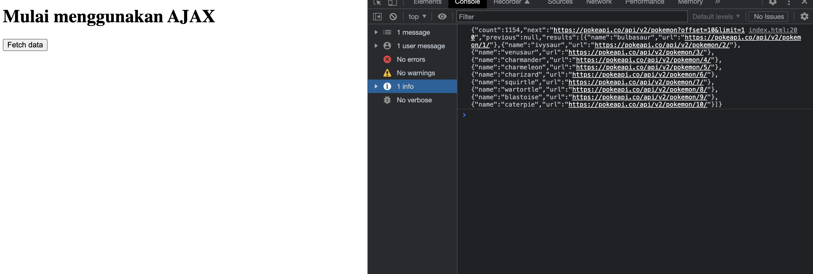
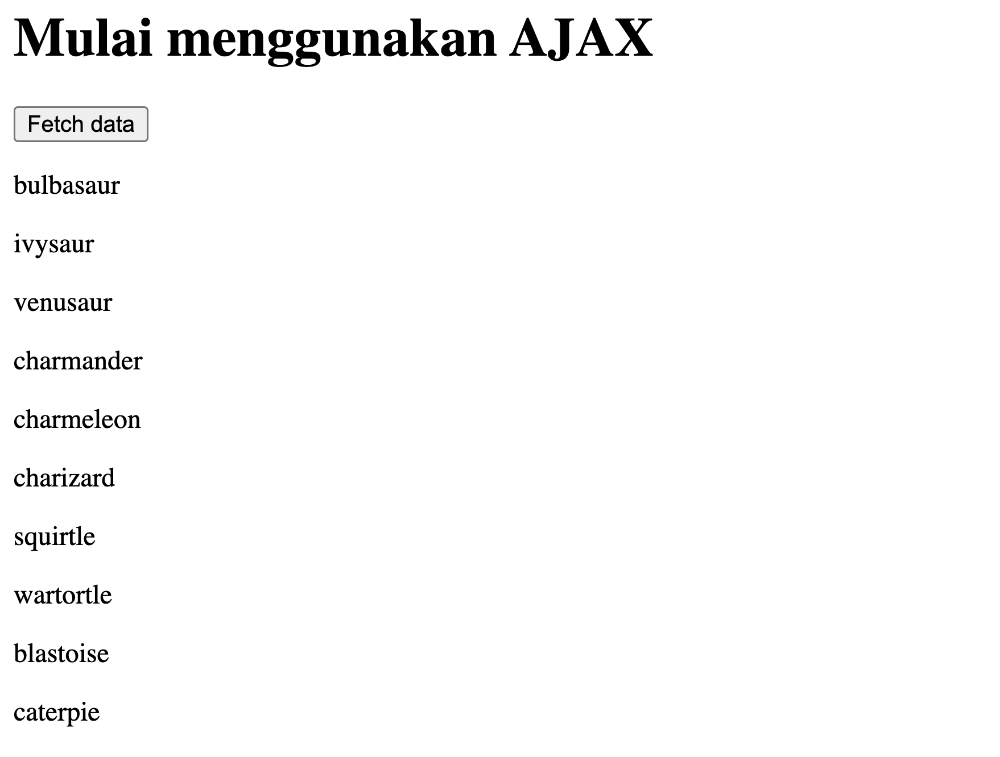

# Proses Asynchronous JavaScript

1. Synchronous dan Asynchronous JavaScript
Pada pemrograman Javascript ada 2 jenis konsep dalam menjalankan sebuah proses. Pertama "Synchronous" dan yang lainnya yaitu"Asynchronous". Perbedaannya adalah pada urutan code yang akan dijalankan.

1. Synchronous
Synchronous adalah proses yang paling sering digunakan dalam pemrograman JavaScript.
Proses synchronous bisa disebut dengan istilah "blocking". Artinya adalah code yang bersifat synchronous akan dijalankan secara berurutan, akan menunggu sebuah proses sampai selesai dijalankan untuk bisa menjalankan proses berikutnya.

Berikut ini contohnya:
`
console.log('Halo')
console.log('Javascript')
console.log('Progate')

/*
Output:

Halo
Javascript
Progate
**/
`

Hasil ini sangat intuitif dan familiar. Eksekusi seluruh baris code di atas secara berurutan.

Ya, itu code yang sangat normal. Intinya adalah, untuk menjalankan baris code untuk mencetak "Progate", perlu menunggu ekskusi baris code "Halo" dan "Javascript" selesai terlebih dahulu. Ini disebut proses Synchronous.

2. Asynchronous
Pada proses asynchronous, code dijalankan dengan konsep "non-blocking".
Hal itu berarti tidak perlu menunggu sebuah proses asynchronous selesai dijalankan untuk dapat menjalankan proses selanjutnya.
Sebagai contoh, kita akan membuat proses asynchronous dengan menggunakan perintah `setTimeout`. `setTimeout` akan menunda proses eksekusi code selama waktu tertentu.

`
console.log('Halo')
// menunda eksekusi selama 500 ms
setTimeout(() => { console.log('Javascript')}, 500) 
console.log('Progate')

/*
Output:

Halo
Progate
Javascript
*/
`

Dari contoh di atas, Eksekusi code untuk menampilkan output "Javascript" akan ditunda selama 500 millidetik (= 0.5 detik) dan ekseskusi code untuk menampilkan output "Progate" bisa langsung dijalankan tanpa menunggu eksekusi baris code selesai.

Ken: Guru, kapan proses ini berguna?
Guru: Itu ketika Kamu menerapkan proses yang memakan waktu lama, misalnya komunikasi dengan server.
Guru: Apakah Kamu ingat hubungan Frontend dan Backend? Frontend mengirim permintaan ke Backend dan Backend menerima informasi dan menyimpannya ke database dan mengirim kembali apa yang diminta ke Frontend dan Frontend menggunakannya pada halaman. Ini butuh waktu lama.

Karena komunikasi dengan sebuah server memerlukan waktu, pengguna harus menunggu hingga proses selesai jika menggunakan sebuah proses synchronous. Proses asynchronous membuatnya menjadi lebih efisien dalam artian kamu dapat melakukan eksekusi code berikutnya seraya menjalankan proses yang memakan banyak waktu.

2. Code Asynchronous
`
const printer = (data) => {
  console.log(data);
}

const power = (a, b) => {
  const result = a ** b;
  return result;
}

const result = power(3, 2)
printer(result)

/*
Output:

9

*/
`
Ada 2 function. Function pertama(printer) berfungsi untuk mencetak output, dan function kedua(power) melakukan operasi eksponensial (pangkat).

Ken: Program ini tidak terlalu sulit.
Guru: Ya, betul. Selanjutnya, kita asumsikan bahwa proses memakan waktu seperti saat berkomunikasi dengan sebuah server dan menunda proses dengan menggunakan setTimeout.

`
const printer = (data) => {
  console.log(data);
}

const power = (a, b) => {
  setTimeout(() => {
    const result = a ** b;
    return result;
  }, 1000);
}

const result = power(3, 2)
printer(result)
`

Dengan code ini, tidak ada yang akan tercetak sebab baris `printer(result)` berjalan sebelum eksekusi dari `const result = power(3,2)` berakhir.

Guru: Dengan code asynchronous, Kamu dapat menjalankan code tanpa menunggu proses yang lama. Tetapi code yang membutuhkan nilai yang dikembalikan dari proses asynchronous harus dijalankan setelah proses asynchronous.

Ken: Oke, jika code di bawah proses asynchronous tidak ada hubungannya dengan proses, itu harus berjalan tanpa menunggu proses, tetapi jika ada code yang membutuhkan informasi setelah proses asynchronous, itu harus menunggu ya.

Guru: Betul. Untuk memperbaikinya, ada 3 teknik penggunaan code asynchronous dalam Javascript.

1. Callback
2. Promise
3. Async/Await

3. Callback
Seperti yang telah Kamu pelajari di JavaScript Study 7, jika kita menggunakan sebuah function sebagai parameter di function lain, maka itu disebut Callback. Callback bisa juga digunakan untuk proses asynchronous.

`
const printer = (data) => {
  console.log(data);
}
  
const power = (a, b, callback) => {
  setTimeout(() => {
      const result = a ** b;
      callback(result);
  }, 1000);
}

power(3, 2, printer)

/*
Output:

9

*/
`

Dalam contoh ini, function power menerima 3 parameter, yaitu huruf `a, huruf b dan sebuah callback`. callback ini merupakan sebuah function, yang akan berjalan setelah mendapatkan hasil dari operasi `a ** b.`

Ken: Masalah terpecahkan! Menggunakan callback, Kamu dapat menjalankan function setelah mendapatkan hasil dari proses asynchronous!

Guru: Ya, tapi callback memiliki sebuah kekurangan, yaitu jika kita ingin menjalankan proses asynchronous lain setelah sebuah callback selesai dijalankan.

Misalnya, kita ingin melakukan perhitungan berikut:
- 3 pangkat 2,
- hasilnya dipangkat 2,
- kemudian hasilnya dipangkat 2 lagi

Dari contoh kasus tersebut, akan ada beberapa callback di dalam sebuah callback.

`
power(3, 2, (result1) => {
  power(result1, 2, (result2) => {
      power(result2, 2, printer)
  })
})

/**
Output:

6561

*/
`

Memang tidak akan terasa sulit untuk dipahami pada awalnya, namun jika kita melakukan operasi yang sama berulangkali, akan mengakibatkan sakit kepala.

`
power(3, 2, (result1) => {
  power(result1, 2, (result2) => {
    power(result2, 2, (result3) => {
      power(result3, 2, (result4) => {
        power(result4, 2, (result5) => {
          power(result5, 2, printer)
        })
      })
    })
  })
})
`

Guru: Code seperti ini sulit untuk dibaca ketika berusaha mengatasinya manakala terjadi error. Biasa diistilahkan dengan "callback hell". Di dalam aplikasi yang besar, ada banyak kasus lain yang membuat kita ingin menambahkan operasi menggunakan data yang telah diambil melalui proses asynchronous.

Guru: Tetapi Kamu dapat menghindari Callback ini dengan Promise. Mari kita lanjutkan ke bagian selanjutnya.

4. Promise
Promise adalah sebuah alternatif dari callback. Silakan lihat code di bawah ini.

`
const printer = (data) => {
  console.log(data);
}

const power = (a, b) => {
  return new Promise((resolve, reject) => {
    setTimeout(() => {
      const result = a ** b;
      resolve(result);
    }, 1000);
  })
}

power(3, 2)
.then(res => {
  return power(res, 2);
})
.then(res => {
  return power(res, 2);
})
.then(res => {
  printer(res);
  return power(res, 2);
})
.catch(err => {
  console.log(err);
})
.finally(() => {
  console.log('Promise telah selesai!');
})

/*
Output:

6561
Promise telah selesai!

*/
`

Dalam menjalankan Promise dengan code `return new Promise((resolve, reject) => {`, kita bisa mendapatkan output dari sebuah proses asynchronous dengan perintah `.then() atau .catch().`
`.then()` mendapatkan hasil dari proses asynchronous ketika proses berjalan dengan sukses dan `.catch()` melakukannya ketika proses gagal.

- `.then()` menerima sebuah parameter yang dikirim dengan perintah resolve.
- `.catch()` juga menerima parameter yang dikirim dengan perintah reject.
- `.finally()` berjalan setelah proses asynchronous selesai, baik itu berhasil ataupun error.

Dalam contoh di atas, hasil proses asynchronous dimasukkan ke dalam `resolve(result)` dan nilai `result` diteruskan ke `res` dari code berikut.

`
.then(res => {
  return power(res, 2);
})
`
Guru: Kita juga bisa menjalankan proses asynchronous berikutnya dengan menggunakan .then() lebih dari satu.

`
power(3, 2)
.then(res => {
  return power(res, 2);
})
.then(res => {
  return power(res, 2);
})
`
Ken: Code terlihat lebih teratur dan lebih mudah dipahami!

Guru: Formatnya disebut "chaining", dan kita menghindari penggunaan callback hell.

Guru: Terakhir, izinkan saya untuk meringkas tahapan Promise.

Promise memiliki 3 stage, yaitu:

1. Pending - kondisi awal ketika Promise dibuat.
2. Resolved - kondisi ketika sebuah proses asynchronous berhasil dijalankan.
3. Rejected - kondisi ketika terdapat error di sebuah proses asynchronous.

### Resolved 
Terjadi ketika perintah `resolve(result)` dijalankan. Artinya proses Promise telah berhasil dijalankan dan me-return sebuah hasil dengan perintah `resolve(result)`. Kita bisa menggunakan hasil yang di-return dengan perintah `.then().`

### Rejected
Terjadi ketika proses asynchronous gagal. Jika terdapat sebuah error, kita bisa menggunakan `reject(err)`, dan kita akan mendapatkan err tersebut dengan perintah `.catch()`.

5. Async/Await
Async/Await adalah cara menulis Promise menjadi lebih simpel dan bersih. Yang perlu kita lakukan adalah menambahkan perintah async di depan sebuah function.

Dalam Async/Await, kita tidak menggunakan `.then(), .catch(), dan .finally()` lagi. Akan tetapi perintah-perintah tersebut akan digantikan dengan format berikut:
- `async` - untuk mendeklarasikan sebuah Async/Await function.
- `try` - blok code untuk menjalankan proses asynchronous.
- `catch` - blok code untuk memproses error dari sebuah proses asynchronous.
- `finally` - seluruh output proses asynchronous akan masuk ke blok ini, baik itu berhasil ataupun error.
- `await` - untuk menunggu sebuah proses asynchronous selesai dijalankan.

`
const printer = (data) => {
  console.log(data);
}

const power = (a, b) => {
  return new Promise((resolve, reject) => {
    setTimeout(() => {
      const result = a ** b;    
      resolve(result);
    }, 1000);
  })
}

const getResult = async () => {
    try {
        const result1 = await power(3, 2);
        const result2 = await power(result1, 2);
        const result3 = await power(result2, 2);
        printer(result3)
    } catch (err) {
        console.log(err);
    } finally {
        console.log('Async/Await telah selesai!');
    }
}

getResult()

/**
Output:

6561
Async/Await telah selesai!
*/
`
Dalam contoh di atas, async function `getResult` didefinisikan dan function `power` yang mengembalikan Promise disebut di dalam.

Saat await digunakan untuk memanggil `power`, eksekusi code berhenti sampai proses selesai dan hasil power dikembalikan, membuat `result1, result2 dan result3` berjalan berurutan.

Guru: Untuk menjalankan Async/Await, kita membutuhkan sebuah function yang diawali dengan async, yang menandakan bahwa function tersebut adalah sebuah Async/Await. Dan ingat Await hanya dapat digunakan dalam function async.

Ken: Dimengerti! Lebih mudah dibaca!

# Berkenalan AJAX
Mari kita mulai belajar tentang AJAX. Karena pengetahuan tentang asyncronous JavaScript digunakan di sini, harap pastikan Kamu sudah memahaminya di materi sebelumnya.

AJAX merupakan kependekan dari Asynchronous JavaScript And XML.
AJAX digunakan untuk mengambil data dari sebuah API dan XML adalah salah satu format data yang dikembalikan dari API.
API adalah singkatan dari Application Programming Interface. Kamu akan mempelajarinya lebih lanjut di bagian selanjutnya.

Salah satu manfaat mengakses data melalui AJAX adalah Kamu dapat membuat permintaan tertentu untuk mengakses data yang Kamu inginkan, tidak seperti meminta seluruh halaman dan seluruh data yang diperlukan untuk halaman.
Sebagai contoh, jika kita menggunakan media sosial, kita bisa membuat status, menuliskan sebuah komentar, atau menekan tombol like. Kemudian, secara otomatis status, komentar, atau like tersebut akan muncul di halaman tersebut tanpa perlu untuk melakukan reload.
Atau pada saat kita menggunakan Google Maps. Ketika kita menggeser tampilan Google Maps ke sebuah area baru, Google Maps secara otomatis akan mengupdate tampilan map tersebut dengan data yang sesuai.

AJAX membuat situs web lebih kaya dan lebih interaktif!

Betul. Dalam materi ini, kita akan menggunakan AJAX untuk mendapatkan data dari API dan menampilkan hasilnya di halaman web.

Berikut langkah-langkahnya:
1. Pahami API yang ingin Kamu akses
2. Mengirim request ke sebuah API dan mendapatkan data
3. Manipulasi DOM untuk menampilkan data ke halaman web tanpa harus melakukan reload

1. Pahami API yang ingin Kamu Akses
Karena ini pertama kalinya Kamu belajar mengenai API, izinkan saya menjelaskan tentang apa itu API.
API adalah singkatan dari Application Programming Interface yang memungkinkan aplikasi untuk berkomunikasi satu sama lain.
Salah satu jenis API yang populer disebut REST API (Representational State Transfer).
Karena REST API mentransfer data menggunakan HTTP, Kamu dapat mengaksesnya melalui URL dengan cara yang sama seperti komunikasi client-server.

Mari kita lihat contohnya!! Lebih mudah untuk memahami!

Oke. Banyak organisasi di dunia menyediakan API mereka sendiri. Mari kita gunakan salah satunya.

PokeApi menyediakan banyak data Pokemon melalui API mereka dan mereka terbuka untuk siapa saja. Kamu dapat mengakses data Pokemon melalui URL yang disediakan PokeApi dan url untuk mengakses API disebut endpoint.
Coba akses endpoint, https://pokeapi.co/api/v2/pokemon?limit=10, yang memberi Kamu 10 data Pokemon.
Kamu dapat klik endpoint tersebut dan akan melihat beberapa data ditampilkan pada browser. Kamu pun akan dapat menggunakan data tersebut dalam aplikasi Kamu menggunakan AJAX.

Format di browser mungkin tidak terlalu mudah dibaca, tetapi format ini sangat populer disebut JSON dan diatur seperti di bawah ini.

`
{
  "count": 1302,
  "next": "https://pokeapi.co/api/v2/pokemon?offset=10&limit=10",
  "previous": null,
  "results": [
    {
      "name": "bulbasaur",
      "url": "https://pokeapi.co/api/v2/pokemon/1/"
    },
    {
      "name": "ivysaur",
      "url": "https://pokeapi.co/api/v2/pokemon/2/"
    },
    {
      "name": "venusaur",
      "url": "https://pokeapi.co/api/v2/pokemon/3/"
    },
    {
      "name": "charmander",
      "url": "https://pokeapi.co/api/v2/pokemon/4/"
    },
    {
      "name": "charmeleon",
      "url": "https://pokeapi.co/api/v2/pokemon/5/"
    },
    {
      "name": "charizard",
      "url": "https://pokeapi.co/api/v2/pokemon/6/"
    },
    {
      "name": "squirtle",
      "url": "https://pokeapi.co/api/v2/pokemon/7/"
    },
    {
      "name": "wartortle",
      "url": "https://pokeapi.co/api/v2/pokemon/8/"
    },
    {
      "name": "blastoise",
      "url": "https://pokeapi.co/api/v2/pokemon/9/"
    },
    {
      "name": "caterpie",
      "url": "https://pokeapi.co/api/v2/pokemon/10/"
    }
  ]
}
`

2. Mengambil Data dari API
Untuk membuat permintaan AJAX, browser memberi Kamu metode bawaan yang disebut XMLHttpRequest. Untuk menjalankan XMLHttpRequest, kita perlu melakukan hal-hal berikut:
- Membuat object XMLHttpRequest
`const xhttp = new XMLHttpRequest();`

- Membuat sebuah Callback function
`xhttp.onload = function() {
  // Apa yang kita lakukan ketika response telah tersedia
  console.log(this.responseText);
}`

- Mengirim request ke server
`xhttp.open("<HTTP_METHOD>", "<URL>");
xhttp.send();`

Ini adalah code untuk mengakses titik akhir PokeApi.
`<!DOCTYPE html>
<html lang="en">
<head>
  <meta charset="UTF-8">
  <title>Progate</title>
</head>
<body>
  <h1>Mulai menggunakan AJAX</h1>

  <button type="button" onclick="fetchData()">Fetch data</button>

  
</body>
</html>`

Sekarang Kamu berhasil menampilkan data dari API di browser Kamu! Tapi AJAX bisa menangani format data lain selain XML ya?

Tangkapan yang bagus, Ken. Walaupun AJAX adalah Asynchronous JavaScript Dan "XML" dan XMLHttpRequest() berisi "XML" dalam namanya, AJAX dapat memproses beberapa format data berikut.

- XML (Extensible Markup Language)
- JSON (JavaScript Object Notation)
- Plain text
- HTML

XML adalah sebuah bahasa markup yang digunakan untuk menyimpan dan mengirim data. Mirip dengan HTML, hanya saja kita bisa membuat sebuah tag sendiri, contohnya:
`<productlisting title:”Daftar Produk”> 
 <product> 
    <name>Produk Pertama</name>
    <price>Produk Pertama</price>
 </product>
</productlisting>`

JSON adalah salah satu format yang digunakan untuk melakukan transfer data. JSON dapat berupa sebuah array atau sebuah object.
`[
	{
		"name": "Produk Pertama",
		"price": 10000
	},
	{
		"name": "Produk Kedua",
		"price": 20000
	}
]`
JSON adalah format yang banyak digunakan dalam API. Harap terbiasa dengannya sebagai pengembang frontend.

3. Menampilkan Data di Halaman Web
Terakhir, mari tunjukkan data yang Kamu dapatkan dari API di halaman web Kamu.

Setelah mendapatkan data dari API, tentunya kita tidak hanya ingin menampilkan output-nya di console. Tetapi juga perlu menampilkan data tersebut di halaman web kita.
Pertama-tama kita akan membuat sebuah 
 untuk menampilkan data yang kita terima dari API.
`

	// tempat untuk menampilkan data response

`

Kemudian kita akan memasukkan data kita ke 
 tersebut.
Kita bisa memilih 
 tersebut dengan perintah document.getElementById("<nama_id>") dan mengganti nilainya dengan perintah .innerHTML.
`document.getElementById("result").innerHTML = this.responseText;`

Dengan code tersebut, kita akan menampilkan seluruh data yang kita terima dari API di halaman web kita.
Tapi, tentunya kita tidak mau hanya menampilkan teks yang kita terima apa adanya. Kita akan melakukan looping data Pokemon dan menampilkan hanya setiap nama Pokemon.

- Ubah format response dari API menjadi format JavaScript object dengan printah JSON.parse() .
- Ambil data aktual yang dibutuhkan. Dalam contoh ini, data Pokemon ada di dalam key results dengan tipe data array.
- Lakukan looping dan mengambil setiap nama Pokemon dan menampilkannya dalam element HTML 
.
`const response = JSON.parse(this.responseText);
const results = response.results;

let data = '';
for (let i = 0; i < results.length; i++) {
  data = data + `
${results[i].name}
`;
}`

Jika kita menggabungkan semua bagian code kita, akan menjadi seperti ini:
`<!DOCTYPE html>
<html lang="en">
<head>
  <meta charset="UTF-8">
  <title>Progate</title>
</head>
<body>
  <h1>Mulai menggunakan AJAX</h1>

  <button type="button" id="button" onclick="fetchData()">Fetch data</button>
  

  
</body>
</html>`

Kita akan menjalankan aplikasi ini kembali, dan melihat perubahan jika kita menekan tombol "Fetch data".

4. Method Fetch
Di atas, kita menggunakan XMLhttpRequest untuk membuat permintaan AJAX. Di sini, saya akan memperkenalkan Kamu metode lain, fetch.

Sebelumnya, XMLHttpRequest memang mainstream untuk mengirimkan request pada API , namun fetch lebih sederhana dan lebih powerful dan semakin hari semakin menjadi pilihan yang lebih baik.
Berbeda dengan XMLHttpRequest, fetch menghasilkan Promise secara default dan kamu dapat menghindari callback hell.
Penggunaan code fetch juga lebih sederhana dan lebih bersifat intuitif seperti pada contoh dibawah ini:
`fetch(<URL>, <OPTIONS>)
  .then(response => response.json())
  .then(data => console.log(data));
`
Sekarang, mari kita gantikan code XMLHttpRequest sebelumnya dengan fetch! Disini mari gunakan Async/Await!
`async function fetchData() {
  const response = await fetch("https://pokeapi.co/api/v2/pokemon?limit=10", {
      method: "GET"
  });

  const json = await response.json();
  const results = json.results;
	
  let data = '';
  for (i = 0; i < results.length; i++) {
    data = data + `
${results[i].name}
`;
  }

  document.getElementById("data").innerHTML = data;
}`

5. Saat Kamu Menggunakan API Gratis
PokeApi itu menyenangkan! Ada banyak hal yang bisa saya lakukan dengan data yang disediakan oleh API!!

Itu benar. Tapi, saya akan membagikan apa yang harus Kamu ingat saat menggunakan API gratis.

Di dunia perangkat lunak, ada banyak source code yang open source dan gratis berkat kontribusi banyak orang dan organisasi.
Namun tentunya membutuhkan biaya untuk menyediakannya di Internet seperti biaya server hosting.
Untuk Ninja kami, saya ingin meminta untuk tidak hanya menjadi pengguna gratis dan menggunakan open source dengan cara yang egois. Di masa depan, ketika Kamu mendapatkan keterampilan, silakan berkontribusi kembali ke dunia perangkat lunak.

Dalam dokumentasi PokeApi, mereka memiliki Kebijakan Penggunaan Adil, dengan mengatakan "PokéAPI pada dasarnya adalah alat pendidikan, dan kami tidak akan mentolerir penolakan layanan serangan yang mencegah orang belajar."